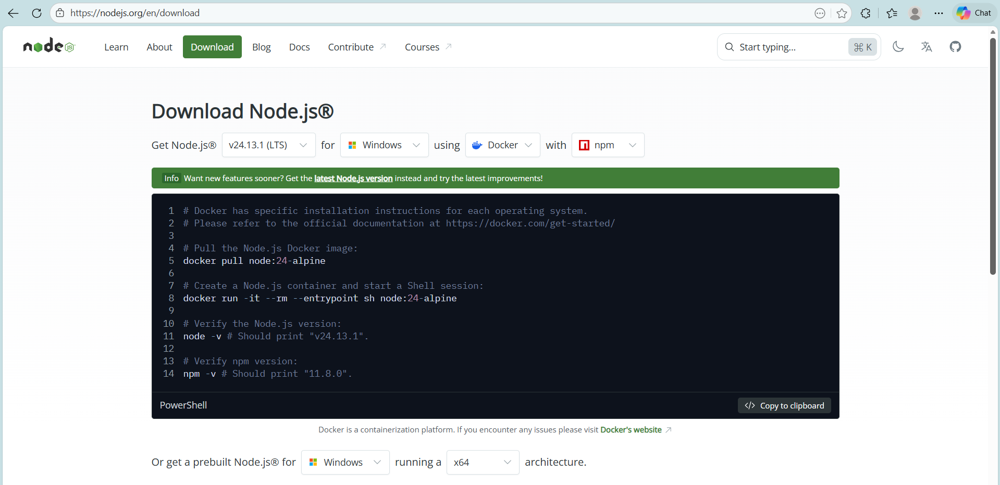
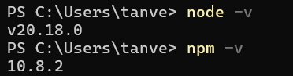
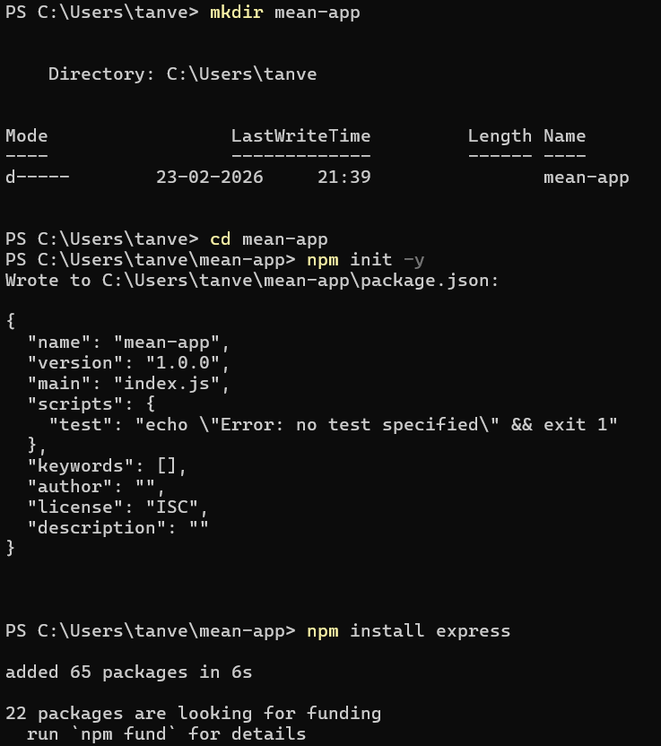
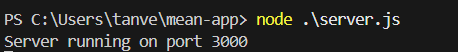
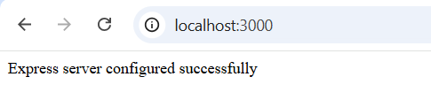

# Experiment No. 1

## Aim

To install, set up, and configure Node.js, npm, and Express framework for developing server-side web applications.

---

## Introduction

Node.js is an open-source JavaScript runtime environment that allows JavaScript to be executed outside the browser. It is built on Chrome’s V8 engine and is widely used for building scalable and efficient backend applications.

npm (Node Package Manager) is the default package manager for Node.js. It is used to install, manage, and maintain project dependencies.

Express.js is a minimal and flexible Node.js web application framework that provides features for creating web servers and RESTful APIs. In the MEAN stack, Node.js and Express together handle backend logic and request-response management.

---

## Procedure

### Step 1: Installation of Node.js and npm

Download and install the LTS version of Node.js from the official Node.js website. During installation, npm is automatically installed along with Node.js.

    

To verify successful installation, open the terminal or command prompt and execute:

    node -v
    npm -v

    

The displayed version numbers confirm that Node.js and npm are installed correctly.

---

### Step 2: Create Project Directory

Create a new directory for the Express application and navigate into it:

    mkdir mean-app
    cd mean-app

---

### Step 3: Initialize npm

Initialize the Node.js project using npm:

    npm init -y

This command generates a `package.json` file which stores project metadata and dependency information.

---

### Step 4: Install Express Framework

Install Express using npm:

    npm install express

    

This adds Express to the project dependencies.

---

### Step 5: Create Express Server

Create a file named `server.js` and write the following code:
const express = require('express');
const app = express();

    app.get('/', (req, res) => {
    res.send('Express server configured successfully');
    });

    const PORT = 3000;
    app.listen(PORT, () => {
    console.log(Server running on port ${PORT});
    });

---

### Step 6: Run the Application

Start the Express server using:

    node server.js

    

Open a web browser and navigate to http://localhost:3000

    

The displayed message confirms that Node.js, npm, and Express have been successfully configured.

---

## Result

Thus, Node.js, npm, and Express framework were successfully installed, configured, and a basic Express server was executed.
