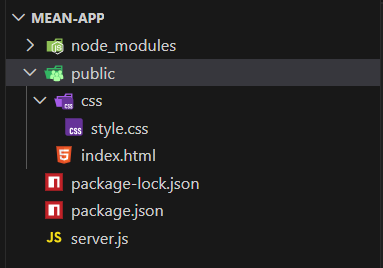
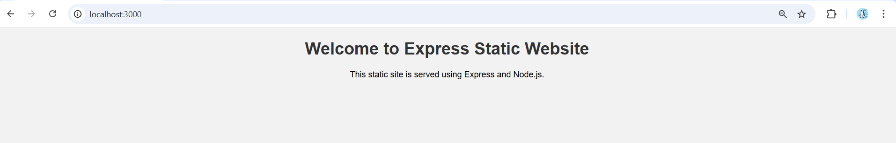

# Experiment No. 2

## Aim

To create an Express project and build a static website using Express and Node.js.

---

## Introduction

Express.js is a popular Node.js framework that simplifies the development of web applications by providing features such as routing, middleware handling, and static file serving. It allows developers to build both dynamic and static web applications efficiently.

A static website consists of fixed content such as HTML, CSS, and images, where the content does not change dynamically. Express provides a built-in middleware to serve static files, making it suitable for hosting static websites.

In this experiment, an Express project is created and configured to serve static web pages using Node.js.

---

## Procedure

### Step 1: Create Express Project Directory

Create a new directory for the Express project and navigate into it:

    mkdir mean-app
    cd mean-app

### Step 2: Initialize npm

Initialize the Node.js project using npm:

    npm init -y

This creates a package.json file for managing project configuration and dependencies.

### Step 3: Install Express Framework

Install Express using npm:

    npm install express

### Step 4: Create Project Structure

Create folders for static files:

    mkdir public
    mkdir public/css

Create an HTML file inside the public folder:

    touch public/index.html

    

### Step 5: Create Static HTML Page

Add the following content to public/index.html:

    <!DOCTYPE html>
    <html lang="en">
    <head>
        <meta charset="UTF-8">
        <title>Express Static Site</title>
        <link rel="stylesheet" href="css/style.css">
    </head>
    <body>
        <h1>Welcome to Express Static Website</h1>
        
This static site is served using Express and Node.js.

    </body>
    </html>

### Step 6: Create CSS File

Create a CSS file inside public/css/style.css and add the following code:

    body {
        font-family: Arial, sans-serif;
        text-align: center;
        background-color: #f2f2f2;
    }

    h1 {
        color: #333;
    }

### Step 7: Create Express Server

Create a file named server.js and write the following code:

    const express = require('express');
    const app = express();

    app.use(express.static('public'));

    const PORT = 3000;
    app.listen(PORT, () => {
        console.log(`Server running on port ${PORT}`);
    });

### Step 8: Run the Application

Start the Express server using:

    node server.js

Open a web browser and navigate to:

    http://localhost:3000

  

The static web page is displayed successfully in the browser.

---

## Result

Thus, an Express project was successfully created and a static website was built and served using Express and Node.js.
