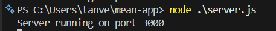
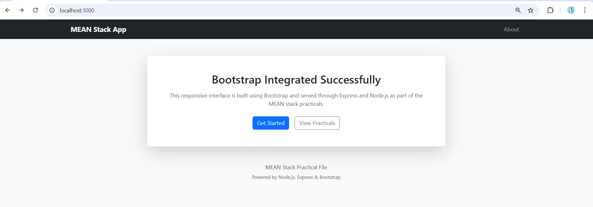

# Experiment No. 3

## Aim

To work on importing Bootstrap for creating quick, responsive, and professional layouts in a web application using Express and Node.js.

---

## Introduction

Bootstrap is a popular front-end framework that provides pre-designed CSS classes and JavaScript components for building responsive and mobile-first web interfaces. It helps developers create clean and professional layouts quickly without writing extensive custom CSS.

Bootstrap includes a responsive grid system, typography styles, navigation components, cards, buttons, and utility classes that adapt automatically to different screen sizes. By integrating Bootstrap into an Express-based project, responsive user interfaces can be developed efficiently.

In this experiment, Bootstrap is imported into the existing Express project (`mean-app`) to enhance the user interface and responsiveness of the static website.

---

## Procedure

### Step 1: Use Existing Express Project

This experiment is performed using the previously created Express project directory:

    mean-app

Ensure that the project structure already contains the `public` folder and `index.html` file.

### Step 2: Import Bootstrap using CDN

Open the existing `public/index.html` file and include Bootstrap CDN links inside the `<head>` section.

Add the following Bootstrap CSS link:

    <link href="https://cdn.jsdelivr.net/npm/bootstrap@5.3.2/dist/css/bootstrap.min.css" rel="stylesheet">

Add the Bootstrap JavaScript bundle before the closing `</body>` tag:

    

### Step 3: Modify HTML Layout using Bootstrap

Update the content of `public/index.html` as follows:

    <!DOCTYPE html>
    <html lang="en">
    <head>
        <meta charset="UTF-8">
        <title>MEAN App – Bootstrap UI</title>
        <meta name="viewport" content="width=device-width, initial-scale=1">

        <!-- Bootstrap CSS -->
        <link href="https://cdn.jsdelivr.net/npm/bootstrap@5.3.2/dist/css/bootstrap.min.css" rel="stylesheet">
    </head>
    <body class="bg-light">

        <!-- Navbar -->
        <nav class="navbar navbar-expand-lg navbar-dark bg-dark">
            

                <a class="navbar-brand fw-bold" href="#">MEAN Stack App</a>

                <button class="navbar-toggler" type="button" data-bs-toggle="collapse" data-bs-target="#navbarMenu">
                    
                </button>

                

                    <ul class="navbar-nav ms-auto">
                        <li class="nav-item">
                            <a class="nav-link" href="#">About</a>
                        </li>
                    </ul>
                

            

        </nav>

        <!-- Main Content -->
        

            

                

                    <!-- Card -->
                    

                        

                            <h2 class="card-title mb-3">Bootstrap Integrated Successfully</h2>
                            

                                This responsive interface is built using Bootstrap and served through
                                Express and Node.js as part of the MEAN stack practicals.
                            

                            

                                <button class="btn btn-primary">Get Started</button>
                                <button class="btn btn-outline-secondary">View Practicals</button>
                            

                        

                    

                

            

        

        <!-- Footer -->
        <footer class="text-center mt-5 text-muted">
            
MEAN Stack Practical File

            <small>Powered by Node.js, Express & Bootstrap</small>
        </footer>

        <!-- Bootstrap JS -->
        
    </body>
    </html>

### Step 4: Run the Application

Start the Express server using:

    node server.js

    

Open a web browser and navigate to:

    http://localhost:3000

    

The web page is displayed with a responsive and professional Bootstrap-based layout.

---

## Result

Thus, Bootstrap was successfully imported into the existing Express project, and a responsive, professional user interface was created using Bootstrap components.