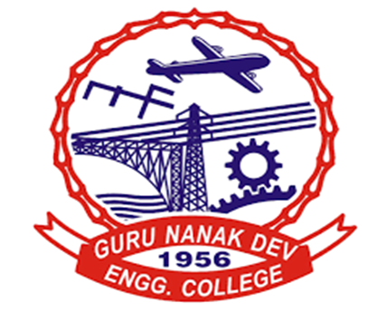

# MEAN: Full Stack Web Development  
###  LPEIT-109

## PRACTICAL FILE

### BACHELOR OF TECHNOLOGY  
#### (Information Technology)

 

  

### SUBMITTED TO  
**PF. JAGDEEP SINGH**

 

### SUBMITTED BY  
**Tanveer Singh Dhanjal**

 

**Class:** D3ITB
 
**College Roll No:** 2321119  
 
**University Roll No:** 2303069

  

### GURU NANAK DEV ENGINEERING COLLEGE, LUDHIANA  
*(An Autonomous College Under UGC Act)*

## List of Practicals

1. To install, setup and configure Express, node and npm packages. 
2. Create Express project and build static site using Express and Node. 
3. Working on the importing Bootstrap option for quick, responsive layouts. 